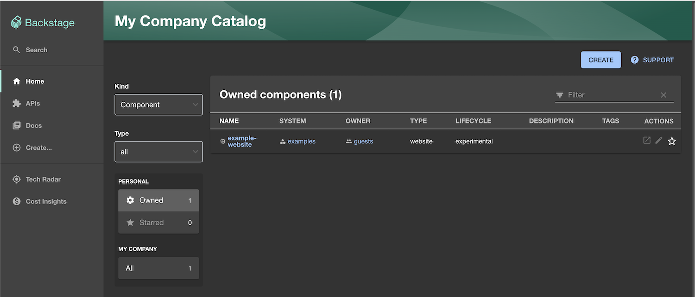
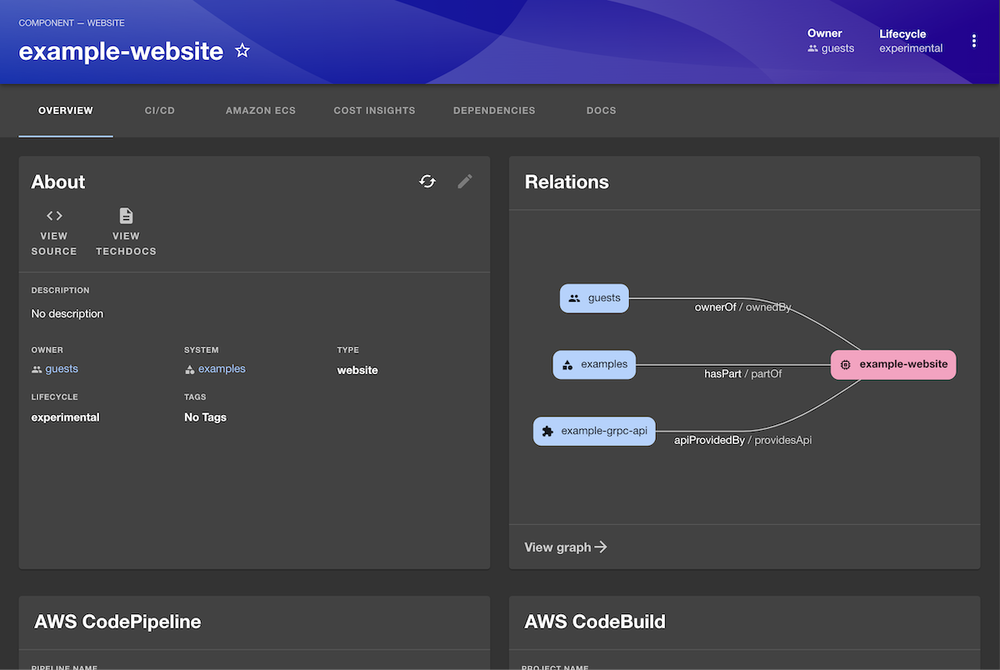
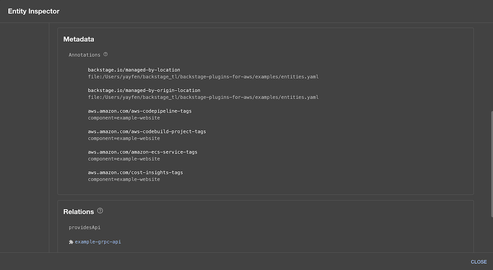
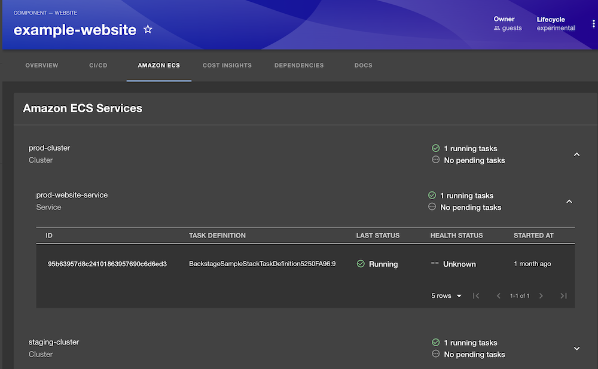

# Tutorial: using the AWS plugins for Backstage

The AWS plugins for Backstage enable you to integrate and manage AWS services directly within Backstage, providing a seamless experience for developers. This tutorial walks you through an example of using the AWS plugins for Backstage.

Tutorial steps:

<!-- toc -->

1. [Prerequisites](#prerequisites)
1. [Clone this repository](#clone-this-repository)
1. [Create prerequisite AWS resources](#create-prerequisite-aws-resources)
1. [Run the Backstage app locally](#run-the-backstage-app-locally)
1. [Explore the Plugins](#explore-the-plugins)
1. [Cleanup](#cleanup)
<!-- tocstop -->

## Prerequisites

Before getting started, ensure you have:

- An AWS account
- Node.js (version 20 or later)

## Clone this repository

Before we start, clone the repository to get access to the necessary sample code and configurations.

```
git clone https://github.com/awslabs/backstage-plugins-for-aws.git
cd backstage-plugins-for-aws
```

## Create prerequisite AWS resources

To get started, we'll deploy a sample AWS CDK project included in the repository. This project streamlines the setup process by automatically provisioning key resources, including an ECS cluster, an ECS service, and a CodePipeline that builds and deploys a container image. These resources enable you to interact with real data through the Backstage plugins, eliminating the need for manual configuration and allowing you to focus on exploring the plugin's functionality.

Instructions

1. Navigate to the CDK Project Directory

   Begin by navigating to the directory containing the CDK project:

   ```
   cd examples/cdk
   ```

2. Install CDK Project Dependencies

   Inside the directory, install the required dependencies:

   ```
   yarn install
   ```

3. Deploy the CDK Stack

   Deploy the sample AWS resources defined in the CDK stack:

   ```
   yarn cdk deploy
   ```

   This will provision sample AWS resources for your project that will show in the Backstage catalog, such as ECS clusters and services.

   Ensure your AWS credentials are configured properly before running the command.

   Deployment may take a few minutes. Once completed, your AWS resources will be ready for use.

## Run the Backstage app locally

With the sample resources in place, you can now run the Backstage app locally to see the plugins in action. The repository already includes pre-installed and configured plugins, so no additional setup is required.

Use the following command to start the Backstage app:

```
yarn dev
```

Open your browser and navigate to `http://localhost:3000`, you should see list of entities in the catalog page:



Click on the `example-website` component to open its details page:



The `example-website` entity is already loaded from the file system. The Backstage app includes an [entities.yaml](../examples/entities.yaml) file that defines this entity and its attributes. This entity is annotated with AWS specific metadata, such as:

```
apiVersion: backstage.io/v1alpha1
kind: Component
metadata:
  name: example-website
  annotations:
    aws.amazon.com/aws-codepipeline-tags: component=example-website
    aws.amazon.com/aws-codebuild-project-tags: component=example-website
    aws.amazon.com/amazon-ecs-service-tags: component=example-website
    aws.amazon.com/cost-insights-tags: component=example-website
```

You can view these annotations directly in Backstage using the `Inspect entity` feature:

- Open the three dots menu in the top-right corner of the entity page.
- Select `Inspect entity` from the dropdown.

This will show the raw YAML configuration, where you can explore the entity's metadata and annotations.



These annotations link the entity to ECS services created by the CDK project, enabling the plugin to fetch and display relevant service details. This is achieved using AWS tags applied to the associated resources. You can review how these tags are defined and applied by checking the CDK project configuration [here](../examples/cdk/lib/cdk-stack.ts#L98).

## Explore the Plugins

The Backstage application in this repository comes with several plugins pre-installed and configured. Lets take a look at some of these plugins and their features.

In the `CI/CD` tab you can see that we've integrated Backstage with AWS CodePipeline. 


This tab shows the recent pipeline executions of the CodePipeline associated with our application, allowing you to easily get a summary of recent activity.

Since this sample application is running on Amazon ECS, you can open the `Amazon ECS` tab to see information about the ECS clusters and services related to this workload.



This view provides you with an aggregate view of the ECS services for this application and the clusters in which they're running, even when these are spread across multiple AWS regions or accounts. You can see the status of the running tasks, and information such as the container image being used, the amount of CPU and memory requested and other details.

## Cleanup

Once you’ve explored the plugins, clean up the resources created by the CDK project to avoid unnecessary costs.

Navigate back to the CDK directory and destroy the deployed stack:

```
cd examples/cdk
cdk destroy
```

Confirm the prompt to delete all resources.
