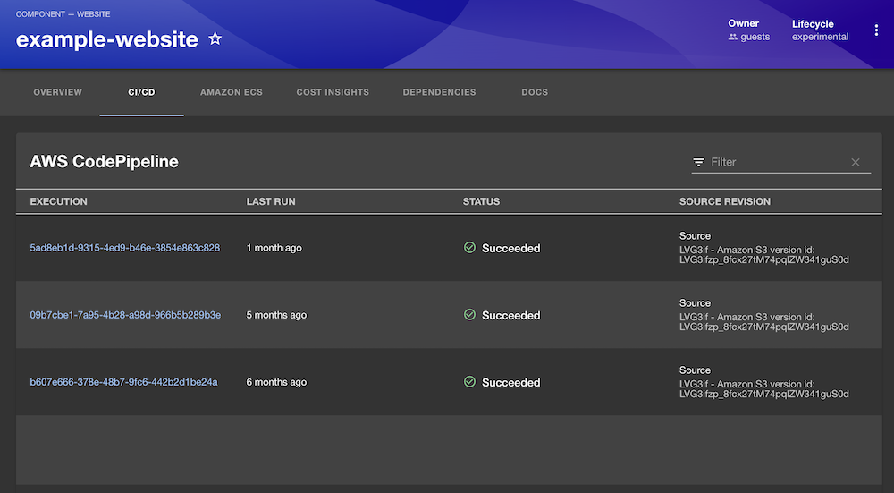

# AWS CodePipeline plugin for Backstage

This is the AWS CodePipeline plugin for backstage.io.



It provides:

1. Entity content that displays the AWS CodePipeline executions related to that specific entity
1. Entity card that displays the status of the AWS CodePipeline stages related to that specific entity

The plugin consists of the following packages:

- `frontend`: The frontend plugin package installed in Backstage
- `backend`: The backend plugin package installed in Backstage
- `common`: Types and utilities shared between the packages

## Installing

This guide assumes that you are familiar with the general [Getting Started](../../docs/getting-started.md) documentation and have assumes you have an existing Backstage application.

### Permissions

The IAM role(s) used by Backstage will require the following permissions:

```json
{
  "Version": "2012-10-17",
  "Statement": [
    {
      "Effect": "Allow",
      "Action": [
        "codepipeline:GetPipelineState",
        "codepipeline:ListPipelineExecutions"
      ],
      "Resource": "*"
    }
  ]
}
```

Note: This policy does not reflect least privilege and you should further limit the policy to the appropriate AWS resources.

### Backend package

Install the backend package in your Backstage app:

```shell
yarn workspace backend add @aws/aws-codepipeline-plugin-for-backstage-backend
```

#### New backend

Add the plugin to the `packages/backend/src/index.ts`:

```typescript
const backend = createBackend();
// ...
backend.add(import('@aws/aws-codepipeline-plugin-for-backstage-backend'));
// ...
backend.start();
```

#### Old backend

Create a file `packages/backend/src/plugins/codepipeline.ts` with the following content:

```typescript
import {
  createRouter,
  DefaultAwsCodePipelineService,
} from '@aws/aws-codepipeline-plugin-for-backstage-backend';
import { CatalogClient } from '@backstage/catalog-client';
import { PluginEnvironment } from '../types';

export default async function createPlugin(env: PluginEnvironment) {
  const catalogApi = new CatalogClient({ discoveryApi: env.discovery });
  const awsCodePipelineApi = await DefaultAwsCodePipelineService.fromConfig(
    env.config,
    {
      catalogApi,
      discovery: env.discovery,
      logger: env.logger,
    },
  );
  return createRouter({
    logger: env.logger,
    discovery: env.discovery,
    awsCodePipelineApi,
  });
}
```

Edit `packages/backend/src/index.ts` to register the backend plugin:

```typescript
// ..
import codepipeline from './plugins/codepipeline';

async function main() {
  // ...
  const codepipelineEnv = useHotMemoize(module, () =>
    createEnv('aws-codepipeline'),
  );
  // ...
  apiRouter.use('/aws-codepipeline', await codepipeline(codepipelineEnv));
  // ...
}
```

Verify that the backend plugin is running in your Backstage app. You should receive `{"status":"ok"}` when accessing this URL:

`https://<your backstage app>/api/aws-codepipeline/health`.

### Frontend package

Install the frontend package in your Backstage app:

```shell
yarn workspace app add @aws/aws-codepipeline-plugin-for-backstage
```

Edit `packages/app/src/components/catalog/EntityPage.tsx` to add AWS CodePipeline content to the CI/CD tab of the entity page:

```typescript
import {
  EntityAwsCodePipelineExecutionsContent,
  isAwsCodePipelineAvailable,
} from '@aws/aws-codepipeline-plugin-for-backstage';

// For example in the CI/CD section
const cicdContent = (
  <EntitySwitch>
    <EntitySwitch.Case if= {isAwsCodePipelineAvailable} >
      <EntityAwsCodePipelineExecutionsContent / >
    </EntitySwitch.Case>
```

Edit the same file to add the AWS CodePipeline card to the entity page:

```typescript
import { EntityAwsCodePipelineCard } from '@aws/aws-codepipeline-plugin-for-backstage';

// For example in the overview section
const overviewContent = (
  <Grid container spacing={3} alignItems="stretch">
  // ...
    <Grid item md={6}>
      <EntityAwsCodePipelineCard />
    </Grid>
```

## Entity annotations

There are two annotations that can be used to reference CodePipeline resources for an entity.

The first will retrieve all CodePipeline resources with the matching tags, this is done with the `aws.amazon.com/aws-codepipeline-tags` annotation:

```yaml
# Example
apiVersion: backstage.io/v1alpha1
kind: Component
metadata:
  # ...
  annotations:
    aws.amazon.com/aws-codepipeline-tags: component=myapp
spec:
  type: service
  # ...
```

Please review the [Locating resources documentation](../../docs/locating-resources.md) to understand any additional configuration required for tag-based lookup.

The alternative is to reference a specific ECS service by ARN, this is done with the `aws.amazon.com/aws-codepipeline-arn` annotation:

```yaml
# Example
apiVersion: backstage.io/v1alpha1
kind: Component
metadata:
  # ...
  annotations:
    aws.amazon.com/aws-codepipeline-arn: arn:aws:codepipeline:us-west-2:1234567890:myapp-pipeline
spec:
  type: service
  # ...
```

## IAM Identity Center shortcut links

As a user of [IAM Identity Center](https://docs.aws.amazon.com/singlesignon/latest/userguide/what-is.html), you can make use of [shortcut links](https://docs.aws.amazon.com/singlesignon/latest/userguide/createshortcutlink.html) by adding your AWS access portal subdomain to your `app-config.yaml`:

```yaml
aws:
  sso:
    subdomain: d-xxxxxxxxxx
```
