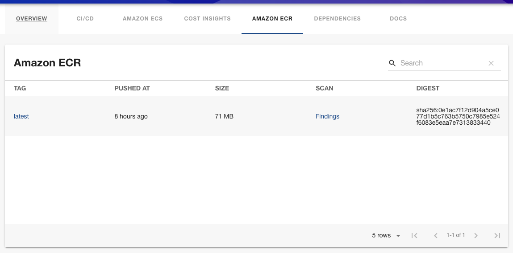

# Amazon Elastic Container Registry plugin for Backstage

This is the Amazon Elastic Container Registry (ECR) plugin for backstage.io.



It provides:

1. Entity content that displays the Amazon Elastic Container Registry repositories related to that specific entity
2. Ability to see scan findings for individual images

The plugin consists of the following packages:

- `frontend`: The frontend plugin package installed in Backstage
- `backend`: The backend plugin package installed in Backstage
- `common`: Types and utilities shared between the packages

## Installing

This guide assumes that you are familiar with the general [Getting Started](../../docs/getting-started.md) documentation and have assumes you have an existing Backstage application.

### Permissions

The IAM role(s) used by Backstage will require the following permissions:

```json
{
  "Version": "2012-10-17",
  "Statement": [
    {
      "Effect": "Allow",
      "Action": ["ecr:DescribeImages", "ecr:DescribeImageScanFindings"],
      "Resource": "*"
    }
  ]
}
```

Note: This policy does not reflect least privilege and you should further limit the policy to the appropriate AWS resources.

### Backend package

Install the backend package in your Backstage app:

```shell
yarn workspace backend add @aws/amazon-ecr-plugin-for-backstage-backend
```

Add the plugin to the `packages/backend/src/index.ts`:

```typescript
const backend = createBackend();
// ...
backend.add(import('@aws/amazon-ecr-plugin-for-backstage-backend'));
// ...
backend.start();
```

### Frontend package

Install the frontend packages in your Backstage app:

```shell
yarn workspace app add @aws/amazon-ecr-plugin-for-backstage
```

Edit the `packages/app/src/components/catalog/EntityPage.tsx` and add the imports

```typescript jsx
import {
  isAmazonEcrAvailable,
  EntityAmazonEcrImagesContent,
} from '@aws/amazon-ecr-plugin-for-backstage';
```

Then add the following components:

```typescript jsx
<EntityLayout.Route path="/ecr" title="Amazon ECR" if={isAmazonEcrAvailable}>
  <EntityAmazonEcrImagesContent />
</EntityLayout.Route>
```

## Entity annotations

There are two annotations that can be used to reference ECR repositories for an entity.

The first will retrieve all ECR repositories with the matching tags, this is done with the `aws.amazon.com/amazon-ecr-tags` annotation:

```yaml
# Example
apiVersion: backstage.io/v1alpha1
kind: Component
metadata:
  # ...
  annotations:
    aws.amazon.com/amazon-ecr-tags: component=myapp
spec:
  type: service
  # ...
```

Please review the [Locating resources documentation](../../docs/locating-resources.md) to understand any additional configuration required for tag-based lookup.

The alternative is to reference a specific ECR repository by ARN, this is done with the `aws.amazon.com/amazon-ecr-arn` annotation:

```yaml
# Example
apiVersion: backstage.io/v1alpha1
kind: Component
metadata:
  # ...
  annotations:
    aws.amazon.com/amazon-ecr-arn: arn:aws:ecr:us-west-2:1234567890:repository/myapp-repository
spec:
  type: service
  # ...
```

## Configuration

There are configuration options available to control the behavior of the plugin.

```yaml
aws:
  ecr:
    maxImages: 100 # (Optional) The maximum amount of images retrieved from a repository
    maxScanFindings: 100 # (Optional) The maximum amount of scan findings retrieved from an image
```

## IAM Identity Center shortcut links

As a user of [IAM Identity Center](https://docs.aws.amazon.com/singlesignon/latest/userguide/what-is.html), you can make use of [shortcut links](https://docs.aws.amazon.com/singlesignon/latest/userguide/createshortcutlink.html) by adding your AWS access portal subdomain to your `app-config.yaml`:

```yaml
aws:
  sso:
    subdomain: d-xxxxxxxxxx
```
