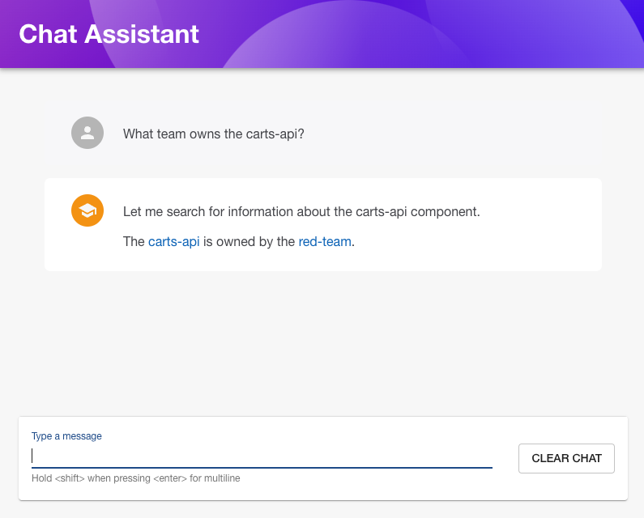

# Generative AI plugin for Backstage (Experimental)

This experimental Backstage plugin helps build generative AI assistants in a manner that can leverage the broader Backstage plugin ecosystem. It relies on "tool use" to provide LLMs with access to existing Backstage backend plugins so that the models can access data via Backstage such as the catalog, TechDocs, CI/CD, Kubernetes resources etc.



Features:

- Simple conversational chat interface
- Configure multiple AI "agents" for specific purposes
- Modular approach to providing agent implementations
- Provide "tools" to agents through Backstage extensions

[See here](https://www.youtube.com/watch?v=DCXzCrIDOAs) for the BackstageCon NA 2024 session where this idea is presented.

## Before you begin

Considerations before you explore this plugin:

1. Its experimental
1. Using this plugin will incur costs from your LLM provider, you are responsible for these
1. This plugin does not build in guardrails or other protective mechanisms against prompt injection, leaking of sensitive information etc. and you are responsible for these

## Pre-requisites

This plugin relies on external LLMs, and will generally require models that support tool-use/function-calling. Some examples of models that support this include:

1. Anthropic Claude >= 3 (Haiku, Sonnet, Opus)
1. OpenAI
1. Meta Llama (certain models)

The example LangGraph implementation provided can use:

1. [Amazon Bedrock](https://aws.amazon.com/bedrock/)
1. [OpenAI](https://openai.com/)

To explore support for other models/providers please raise a GitHub issue.

## Installation

NOTE: This guide will use the provided LangGraph implementation. To implement your own agent type see [Extending](#extending).

This guide assumes that you are familiar with the general [Getting Started](../../docs/getting-started.md) documentation and have assumes you have an existing Backstage application.

### Backend package

Install the backend package in your Backstage app:

```shell
yarn workspace backend add @aws/genai-plugin-for-backstage-backend @aws/genai-plugin-langgraph-agent-for-backstage
```

Add the plugin to the `packages/backend/src/index.ts`:

```typescript
const backend = createBackend();
// ...
backend.add(import('@aws/genai-plugin-for-backstage-backend'));
backend.add(import('@aws/genai-plugin-langgraph-agent-for-backstage'));
// ...
backend.start();
```

Verify that the backend plugin is running in your Backstage app. You should receive `{"status":"ok"}` when accessing this URL:

`http://<your backstage app>/api/aws-genai/health`.

### Frontend package

Install the frontend package in your Backstage app:

```shell
yarn workspace app add @aws/genai-plugin-for-backstage
```

Edit `packages/app/src/App.tsx` to add a route for the chat UI page:

```typescript
import { AgentChatPage } from '@aws/genai-plugin-for-backstage';

{
  /* ... */
}

const routes = (
  <FlatRoutes>
    /* ... */
    <Route path="/assistant/:agentName" element={<AgentChatPage />} />
  </FlatRoutes>
);
```

Now edit `packages/app/src/components/Root/Root.tsx` to add a menu item:

```tsx
import { ChatIcon } from '@backstage/core-components';

{
  /* ... */
}
export const Root = ({ children }: PropsWithChildren<{}>) => (
  <SidebarPage>
    <Sidebar>
      {/* ... */}
      <SidebarGroup label="Menu" icon={<MenuIcon />}>
        {/* ... */}
        <SidebarItem
          icon={ChatIcon}
          to="assistant/general"
          text="Chat Assistant"
        />
        {/* ... */}
      </SidebarGroup>
      {/* ... */}
    </Sidebar>
    {/* ... */}
  </SidebarPage>
);
```

The URL `assistant/general` means we're going to be using an agent named `general`, which we'll configure below.

### Creating your first agent

This plugin is built around the notion of creating one or more "agents" that can be invoked. These are defined by configuration, so lets configure our first agent.

Add this to your Backstage configuration file (for example `app-config.yaml`):

```yaml
genai:
  agents:
    general: # This matches the URL in the frontend
      description: General chat assistant
      prompt: >
        You are an expert in platform engineering and answer questions in a succinct and easy to understand manner.

        Answers should always be well-structured and use well-formed Markdown.

        The current user is {username} and you can provide that information if asked.
      langgraph:
        messagesMaxTokens: 150000 # Set based on context of chosen model, prune message history based on number of tokens
        # Use appropriate snippet for your model provider
        bedrock:
          modelId: 'anthropic.claude-3-5-sonnet-20241022-v2:0'
          region: us-west-2
        # openai:
        #   apiKey: ${OPENAI_API_KEY}
```

See the [LangGraph agent documentation](./agent-langgraph/) for the full configuration reference.

Start the Backstage application:

```
yarn start
```

Access the application in your browser and select the "Chat Assistant" option in the menu. Ask a general question like "What is Terraform?".

### Adding tools

We can provide tools/functions that can be called by agents to retrieve context or perform actions. Tools can be added to the agent using a Backstage extension point and packaged as NPM packages.

There are several tools built in to the plugin related to core Backstage functionality. The `backstageCatalogSearch`, `backstageEntity` and `backstageTechDocsSearch` tools to give the model basic access to the Backstage catalog and TechDocs documentation.

Update the previous agent definition to add the `tools` field:

```yaml
genai:
  agents:
    general:
      description: [...]
      prompt: [...]
      langgraph: [...]
      tools:
        - backstageCatalogSearch
        - backstageEntity
        - backstageTechDocsSearch
```

Restart Backstage to reload the configuration and try asking the chat assistant a question related to information in the your Backstage catalog, for example "Summarize <component name> from the Backstage catalog".

NOTE: After Backstage starts locally there can be a delay indexing the catalog and TechDocs for search. You will not receive search results until the index is built.

### Agents communicating

Provided is a simple mechanism to allow agents to communicate, which treats agents as tools. You can prefix any other agent name with `agent:` as a tool name and it will treat it as a tool for the configured agent to invoke.

```yaml
genai:
  agents:
    general:
      description: [...]
      prompt: [...]
      langgraph: [...]
      tools:
        - agent:weather
    weather:
      description: [...]
      prompt: [...]
      langgraph: [...]
```

The tool for invoking agents simply accepts a parameter called `query` which is expected to be a natural language query, and it will respond with the raw text output of the agent.

## Further reading

You can view the rest of the documentation to understand how to evolve your chat assistant

1. Prompting tips: Various tips on how to configure the agent system prompt. [See here](./docs/prompting-tips.md).
1. Tools: Provide tools/functions that can be called by agents to retrieve context or perform actions. [See here](./docs/tools.md).
1. Agent implementation: Provide an implementation for how an agent responds to prompts. [See here](./docs/agent-types.md).
