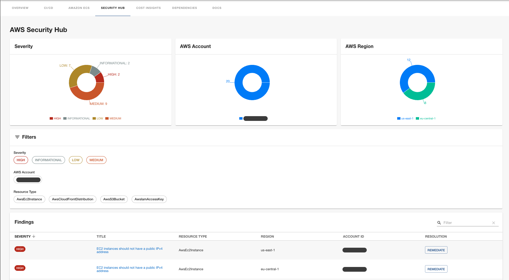

# AWS Security Hub plugin for Backstage

This plugin integrates AWS Security Hub V1 with Backstage, allowing you to view and manage security findings for your AWS resources directly within the Backstage catalog.



The plugin consists of the following packages:

- `frontend`: The frontend plugin package installed in Backstage
- `backend`: The backend plugin package installed in Backstage
- `common`: Types and utilities shared between the packages
- `tools`: GenAI agent actions for Security Hub integration

## Installing

This guide assumes that you are familiar with the general [Getting Started](../../docs/getting-started.md) documentation and have an existing Backstage application.

### Permissions

The IAM role(s) used by Backstage will require the following permissions:

```json
{
  "Version": "2012-10-17",
  "Statement": [
    {
      "Effect": "Allow",
      "Action": [
        "securityhub:GetFindings",
        "securityhub:DescribeHub"
      ],
      "Resource": "*"
    }
  ]
}
```

Note: This policy does not reflect least privilege and you should further limit the policy to the appropriate AWS resources.

### Backend package

Install the backend package in your Backstage app:

```shell
yarn workspace backend add @aws/aws-securityhub-plugin-for-backstage-backend
```

Add the plugin to the `packages/backend/src/index.ts`:

```typescript
const backend = createBackend();
// ...
backend.add(import('@aws/aws-securityhub-plugin-for-backstage-backend'));
// ...
backend.start();
```

### Frontend package

Install the frontend package in your Backstage app:

```shell
yarn workspace app add @aws/aws-securityhub-plugin-for-backstage
```

Add the Security Hub tab to your entity pages. Edit `packages/app/src/components/catalog/EntityPage.tsx`:

```tsx
import { EntityAwsSecurityHubContent } from '@aws/aws-securityhub-plugin-for-backstage';

const serviceEntityPage = (
  <EntityLayout>
    {/* ... */}
    <EntityLayout.Route path="/security-hub" title="Security Hub">
      <EntityAwsSecurityHubContent />
    </EntityLayout.Route>
  </EntityLayout>
);
```

## Entity annotations

The plugin uses entity annotations to determine what Security Hub findings to display for a given entity. The `aws.amazon.com/aws-securityhub-findings-tags` annotation can be added to any catalog entity to filter findings based on AWS resource tags split by comma.

```yaml
apiVersion: backstage.io/v1alpha1
kind: Component
metadata:
  name: my-service
  annotations:
    aws.amazon.com/aws-securityhub-findings-tags: component=my-service,environment=prod
spec:
  type: service
  # ...
```

This allows flexibility regarding how findings are retrieved for different entities. For example, a `Group` entity might look like this:

```yaml
apiVersion: backstage.io/v1alpha1
kind: Group
metadata:
  name: platform-team
  annotations:
    aws.amazon.com/aws-securityhub-findings-tags: team=platform
spec:
  type: team
```

## Configuration

The plugin supports following configuration in `app-config.yaml`:

```yaml
aws:
  securityHub:
    region: us-east-1 # (Optional) AWS region, defaults to AWS SDK default region resolution
    accountId: '1111111111' # (Optional) AWS account ID, defaults to the account from default credentials
    # Optional: Custom filters to override defaults
    # filters:
    #   - name: SeverityLabel
    #     values: ['CRITICAL', 'HIGH']  # Multiple values
    #     comparison: EQUALS
    #   - name: ComplianceStatus
    #     value: FAILED  # Single value
    #     comparison: EQUALS
    # Optional: AI Agent configuration (see GenAI Integration section)
    agent:
      enabled: true # (Optional) Enable AI assistant for findings, defaults to true
      name: 'security-hub'  # Name of the agent configured in genai.agents
```

### Default Filters

By default, the plugin filters findings to show only active and actionable items:

- **WorkflowStatus**: `NEW` or `NOTIFIED` (excludes resolved, suppressed, or dismissed findings)
- **RecordState**: `ACTIVE` (excludes archived findings)
- **ResourceTags**: Filtered based on the entity's `aws.amazon.com/aws-securityhub-findings-tags` annotation

### Custom Filters

You can override the default filters or add additional filters using the `filters` configuration. Custom filters will **replace** the default WorkflowStatus and RecordState filters, so include them explicitly if needed.

Available filter options:
- **name**: The Security Hub filter field name (e.g., `SeverityLabel`, `ComplianceStatus`, `WorkflowStatus`, `RecordState`)
- **value**: Single value for the filter
- **values**: Array of values for the filter (use either `value` or `values`, not both)
- **comparison**: Comparison operator (default: `EQUALS`). Options: `EQUALS`, `PREFIX`, `NOT_EQUALS`, `PREFIX_NOT_EQUALS`, `CONTAINS`, `NOT_CONTAINS`

Example - Show only critical and high severity findings that are still active:
```yaml
aws:
  securityHub:
    filters:
      - name: SeverityLabel
        values: ['CRITICAL', 'HIGH']
        comparison: EQUALS
      - name: WorkflowStatus
        values: ['NEW', 'NOTIFIED']
        comparison: EQUALS
      - name: RecordState
        value: ACTIVE
        comparison: EQUALS
```


### Multi-account and cross-region configuration

AWS Security Hub supports cross-account and cross-region aggregation through its administrator-member account model and finding aggregation features.

This configuration will:
- Aggregate findings from all member accounts in your AWS Organization
- Collect findings from all AWS regions into your designated aggregation region
- Provide centralized visibility in the Security Hub administrator account

**Note:** This configuration assumes that Backstage will fetch all findings from aggregated accounts and linked regions. The plugin doesn't have restriction mechanisms (for now) that will prevent teamA from seeing findings of teamB. You can use Backstage permissions for UI access control and configure backend proxy to restrict access based on ownership relation.

#### Cross-Account Aggregation

1. Designate a Security Hub administrator account (typically your security/audit account)
2. Enable Security Hub in the administrator account
3. Invite or auto-enable member accounts from AWS Organizations

Learn more in [AWS documentation](https://docs.aws.amazon.com/securityhub/latest/userguide/central-configuration-intro.html).

#### Cross-Region Aggregation

Enable finding aggregation in your administrator account:
```bash
# Create aggregation region (choose your primary region)
aws securityhub create-finding-aggregator \
    --region us-east-1 \
    --region-linking-mode ALL_REGIONS
```

Learn more in [AWS documentation](https://docs.aws.amazon.com/securityhub/latest/userguide/finding-aggregation.html).


## GenAI Integration

The plugin provides two types of GenAI integration to help with security finding analysis and remediation.

**Prerequisites:**
- Install and configure the `@aws/genai-plugin-for-backstage` plugin ([documentation](https://github.com/awslabs/backstage-plugins-for-aws/tree/main/plugins/genai)).

### 1. AI Assistant for Individual Findings

Each finding in the UI includes an AI assistant that provides tailored analysis and remediation steps. When enabled, users can:
- View official AWS remediation guides (always available)
- Ask an AI agent for customized analysis and remediation specific to their finding context

**Configuration:**

Add the AI agent configuration in `app-config.yaml`:

```yaml
aws:
  securityHub:
    agent:
      enabled: true  # Set to false to disable AI assistant
      name: 'security-hub'  # Name of the agent configured in genai.agents

genai:
  agents:
    security-hub:
      description: AWS Security Hub finding analysis and remediation assistant
      langgraph:
        messagesMaxTokens: 15000
        bedrock:
          modelId: amazon.nova-lite-v1:0 # or other model
          region: us-east-1
      prompt: |
        You are an AWS security expert assistant helping developers understand and remediate 
        AWS Security Hub findings. Provide clear, actionable guidance with code examples when appropriate.
```

**Features:**
- Contextual analysis of each finding
- Tailored remediation steps with code examples
- Response caching to reduce costs and improve performance
- Structured output with Analysis and Remediation sections

### 2. GenAI Actions for Querying Findings

The backend plugin automatically registers an action that allows AI assistants to query Security Hub findings across entities.

**Configuration:**

Add the action to your GenAI agent in `app-config.yaml`:

```yaml
backend:
  actions:
    pluginSources:
      - 'catalog' # built-in actions from Backstage
      - 'aws-securityhub' # add this line

genai:
  agents:
    general:
      description: AWS platform assistant
      langgraph:
        messagesMaxTokens: 15000
        bedrock:
          modelId: amazon.nova-lite-v1:0 # or other model
          region: us-east-1
      actions:
        - get-catalog-entity # built-in Backstage action
        - get-amazon-securityhub-findings  # add this action
      prompt: |
        You are an AWS platform expert helping developers with security and compliance.
```

Now, you can ask a Chat Assistant to query findings across your catalog entities:

```text
What security finding from securityhub does my component <COMPONENT NAME> have?
```

The `get-amazon-securityhub-findings` action retrieves Security Hub findings for catalog entities and returns a formatted summary including title, ID, severity, description, remediation URL, creation date, and AWS account ID.


## Features

- **Security Findings Dashboard**: View all Security Hub findings for your catalog entities
- **Severity Filtering**: Filter findings by severity (CRITICAL, HIGH, MEDIUM, LOW, INFORMATIONAL)
- **Finding Details**: View detailed information about each finding including remediation steps
- **AI-Powered Remediation**: Get tailored analysis and remediation guidance for individual findings using GenAI
- **Response Caching**: AI responses are cached to reduce costs and improve performance
- **GenAI Actions**: Query findings across entities using natural language through GenAI agent actions
- **Multi-account Support**: Query findings across multiple AWS accounts using Security Hub aggregation
- **Custom Filters**: Configure custom filters to focus on specific finding types or compliance statuses

## Troubleshooting

### No findings displayed

- Verify the entity has the `aws.amazon.com/aws-securityhub-findings-tags` annotation
- Ensure Security Hub is enabled in your AWS account
- Check that AWS resources are properly tagged
- Verify AWS credentials have the required permissions

### Permission errors

Ensure your AWS credentials have:
- `securityhub:GetFindings`
- `securityhub:DescribeHub`
